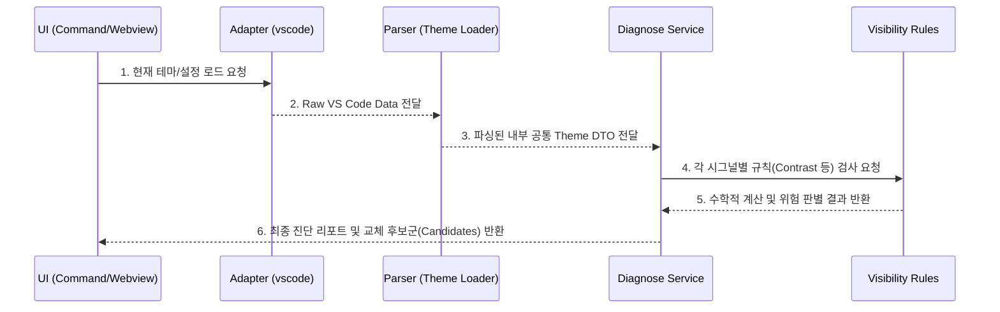
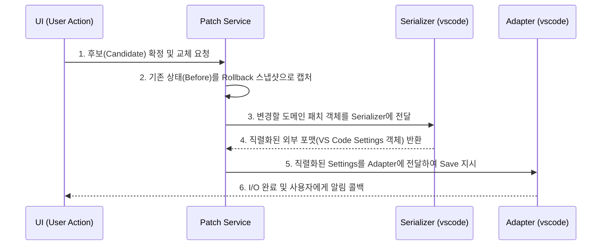

# Color Calibration 아키텍처 및 디렉토리 구조 명세

이 문서는 Color Calibration Extension의 전체적인 아키텍처 설계와 데이터 흐름을 명확히 정의하여, 개발 및 Agent들의 이해를 돕기 위해 작성되었습니다.

## 1. 아키텍처 핵심 원칙 (Architectural Decisions)

- **순수 함수와 부수 효과(I/O)의 엄격한 분리**: 비즈니스 핵심 로직(진단, 패치 데이터 조립, 직렬화)은 I/O가 없는 순수 함수로 구성되며, `Adapter` 계층에서만 외부 환경과 통신합니다.
- **도메인 객체 (DTO) 패턴 적용**: `types/` 디렉토리에 정의된 타입들은 시스템 전반에서 통신을 위한 DTO(Data Transfer Object) 역할을 수행합니다. 특정 환경에 종속되지 않은 우리의 내부 공통 객체입니다.
- **Serializer와 Adapter의 분리 (중요)**: `Serializer` 모듈은 내부 객체를 특정 환경(예: VS Code)의 JSON 형식으로 바꿔주는 "순수 데이터 변환" 역할만 합니다. 변환이 끝난 데이터를 `Adapter`에게 전달하여 실제 I/O 저장을 지시하는 역할은 Orchestrator인 `PatchService`가 담당합니다. (Serializer가 Adapter를 직접 호출하지 않습니다.)

---

## 2. 디렉토리 구조 (Directory Structure)

`src/` 하위 폴더는 철저히 역할(Role)과 데이터 흐름에 따라 분리되어 있습니다.

```text
src/
 ├── types/        # [도메인 객체] 모든 계층이 공유하는 내부 공통 DTO 및 인터페이스 명세
 ├── adapter/      # [I/O] 외부 환경(VS Code API 등)과의 통신. Raw Data 로드 및 실제 쓰기(Save)
 ├── parser/       # [변환] Adapter가 가져온 Raw Data를 내부 도메인 Theme Data로 파싱
 ├── diagnose/     # [엔진] 룰 베이스 연산. 시그널을 검사하고 위험을 진단하며 교체 후보군 생성
 ├── patch/        # [제어] 유저의 변경 요청을 처리하는 흐름 제어(Orchestrator). 롤백 스냅샷 기록
 ├── serializer/   # [변환] 내부 객체(도메인 데이터)를 다시 VS Code 설정 포맷(Raw)으로 직렬화 (순수 함수)
 ├── ui/           # [표현] Webview ViewModel 구성, HTML 렌더링 및 알림 포맷팅 로직 격리
 └── extension.ts  # [진입점] 명령어 등록 및 전체 로직 체인을 조합하여 실행
```

### 2.1. 각 계층별 기대 역할 및 검증(Test) 기준
화이트박스 검증 및 향후 테스트 코드 작성 시, 다음의 규칙들이 각 모듈 내에서 반드시 지켜져야 합니다.

- **`adapter/` (I/O 담당)**
  - 역할: VS Code의 API와 직접 소통하며 테마 데이터를 읽고(`get`), 패치 데이터를 씁니다(`update`).
  - 제약: 비즈니스 판단(어떤 색상이 좋은지, 위험한지) 로직이 **절대** 포함되어서는 안 됩니다.
  - 테스트: 실제 VS Code API 객체를 모킹(Mocking)하여, I/O 메서드가 정확한 파라미터로 호출되는지만 검증합니다.

- **`parser/` (로더 및 파서)**
  - 역할: 외부의 JSON 형태인 Raw 테마 데이터를 파싱하여 `types/`에 정의된 내부 도메인 객체로 변환합니다.
  - 제약: 파일시스템이나 외부 API에 직접 접근하지 않아야 하며, 입력된 데이터를 순수하게 변환만 해야 합니다.

- **`diagnose/` (진단 및 엔진)**
  - 역할: 테마 데이터를 바탕으로 가시성을 계산하고(Contrast), 주입받은 외부 룰(`CandidateMappingRule[]`)에 따라 교체 후보군을 동적으로 생성합니다.
  - 제약: 내부에 특정 색상 헥스코드(`#ff6b6b` 등)를 **하드코딩해서는 안 됩니다**. 무조건 외부에서 주입된 룰(Rules)에 기반해 연산해야 하는 **순수 함수** 계층입니다.
  - 테스트: 가상의 극단적인 규칙(Fixture)들을 주입했을 때, 엔진이 해당 규칙에 맞게 정확히 후보군을 매핑하는지를 집중적으로 검증합니다.

- **`patch/` (오케스트레이터)**
  - 역할: 사용자가 선택한 패치 후보군들을 바탕으로 '적용할 다음 설정'과 '롤백용 스냅샷'을 계산합니다.
  - 제약: 이 모듈 자체는 VS Code API를 호출해 설정값을 저장하지 않습니다. 오직 "어떻게 업데이트해야 하는지"에 대한 계획(Plan) 객체만 반환합니다.

- **`serializer/`**
  - 역할: PatchService가 만든 도메인 객체를 다시 VS Code가 알아들을 수 있는 JSON 형식으로 직렬화(포맷팅)합니다.
  - 제약: 어떠한 의존성도 없는 완전한 순수 함수여야 합니다.

- **`ui/` (뷰 및 포맷터)**
  - 역할: Webview에 그릴 HTML 문자열을 생성하고, 사용자에게 띄울 Notification 메시지를 만듭니다.

- **`extension.ts` (진입점)**
  - 역할: 위의 모든 모듈들을 조립(Wiring)합니다. 
  - 제약: 이곳에는 복잡한 비즈니스 계산식이 없어야 하며, 단순히 모듈 A의 결과를 모듈 B로 넘겨주는 파이프라인 역할만 수행해야 합니다.

---

## 3. 데이터 흐름도 (Data Flow)

각 계층이 어떻게 상호작용하는지를 보여주는 시퀀스 다이어그램입니다.

### 3.1. 로드 및 진단 흐름 (Load & Diagnose Flow)

사용자의 환경 설정을 읽고, 이를 파싱한 뒤, 규칙에 맞추어 안 보이는 색상을 찾아내는 과정입니다.



### 3.2. 패치 및 롤백 흐름 (Patch & Rollback Flow)

사용자가 제안된 색상 후보를 수락했을 때, 이를 VS Code 환경에 저장하는 과정입니다.


